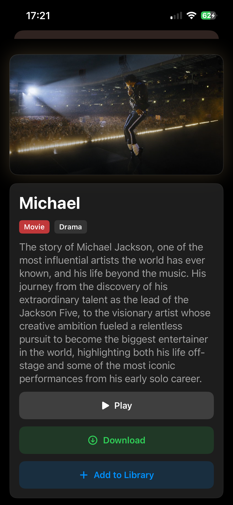

# Streamify

Streamify is a SwiftUI iOS app for browsing, importing, downloading, and playing movies and TV shows.

Or more correctly a vibecoded slop app that looks kinda cool

The app has TMDB support for populating the library.

For streaming and downloads it has support for Torrentio, 111movies and VidLink. 

## Screenshots

Home                             |  Movie card
:-------------------------------:|:-------------------------------:
 | 

## MKV Playback

This app uses uses [edde746/MPVKit](https://github.com/edde746/MPVKit) for MKV streaming as that fork supports HDR and Spatial Audio.

## Build

```bash
./scripts/xtool-build.sh
```

This app was made to be built with xtool, of course you can generate an xcodeproj to make it build with Xcode as well (check out build workflow).

## Why The Script Exists

It prepares everything for you, thats it

And if you're on WSL, SwiftPM crashes with:

FoundationNetworking/EasyHandle.swift: Fatal error:
'try!' expression unexpectedly raised an error: Error Domain=libcurl.Easy Code=43

To avoid that we download the same artifacts with curl, extracting them locally.
